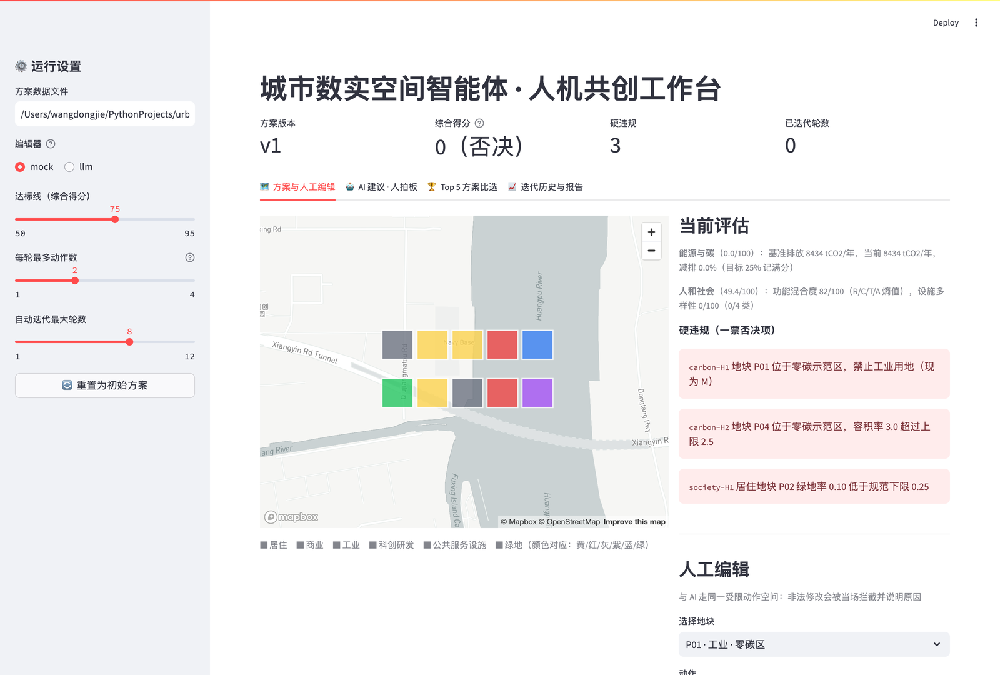
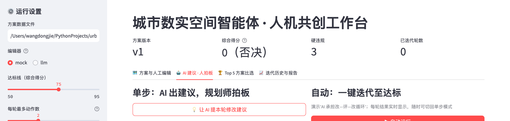
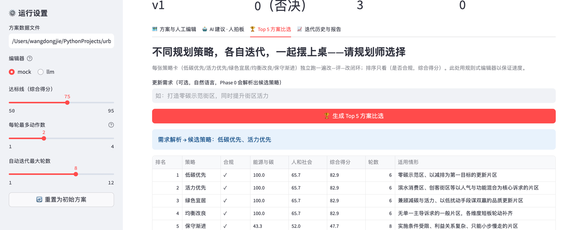
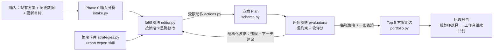

# 城市数实空间智能体 · Urban Renewal Agent

> 让 AI 承担城市更新方案"改—评—再改"的循环，规划师专注专业判断与最终拍板。
>
> 2026 AI4CITY 暑期训练营（5 天）· 王东杰（AI 方向，University of Kansas）× 刘超（规划方向，同济大学）

---

## 这是什么

一次真实的城市更新任务：手里有现有规划方案（文字与图纸）、历史数据（交通/经济/人口）和更新目标，规划师做分析，然后进入漫长的"改方案—核对指标—再改"循环，最后拿几版方案做比选。本项目把这条流程整体交给智能体跑，人只在关键处出手：

- **输入分析（Phase 0）**：把规划文件与更新需求转译成目标配置与候选策略（`intake.py`）；
- **策略卡库（urban expert skill）**：把规划师的思维写成机器能执行的卡片——低碳优先、活力优先、绿色宜居、均衡改良、保守渐进…（`strategies.py`）；
- **编辑模块**：LLM（大语言模型）按策略卡思路，通过受限动作空间对方案做局部、可解释、可回滚的修改；
- **评估模块**：双轨评测——硬约束（红线）程序化校验、一票否决，软质量 0-100 打分，并把"下一步怎么改"作为结构化建议回给编辑模块；
- **Top 5 方案比选**：每张策略卡各自迭代出一版方案，排序生成比选报告，**请规划师选择**（`portfolio.py`）；
- **人机共创工作台**：需求输入 → 生成比选 → 载入所选方案 → AI 出建议、规划师拍板，全自动只是演示模式。

试点区域为上海杨浦**复兴岛**（约 1.4 km²）。当前仓库是一个**已经端到端能跑的骨架**：玩具数据上单策略闭环 6 轮从"3 项硬违规、0 分"改到"82.9 分达标"；`python -m urban_agent.compare` 一条命令产出五策略比选报告。

## 工作台长什么样

改方案、看后果——地图实时变色，硬违规一票否决，人和 AI 走同一个受限动作空间：



AI 出建议、你来拍板——每条建议带理由，勾选后才执行：



输入一句更新需求，五张策略卡各跑一遍，排序成 Top 5 供规划师选择——有的策略达标，有的（如"保守渐进"拒绝改用地）够不到线：



## 系统架构



核心设计决策（为什么这么做）：

| # | 决策 | 理由 |
|---|---|---|
| 1 | 地块级结构化表示，不做图则级几何编辑 | LLM 改属性可靠，改几何不可靠 |
| 2 | 编辑 = 受限动作空间 + function calling | 每次局部、可解释、可回滚、自带合规校验 |
| 3 | 双轨评测，任一硬违规综合分归零 | "按规矩来"永远优先于"分数好看" |
| 4 | 反馈机器可执行（违规带 `fix` 动作） | 这是闭环能收敛的前提 |
| 5 | 规划师思维写成策略卡进库，不散落在 prompt 里 | 策略即数据：可比选、可复用、可署名 |
| 6 | 出口是 Top-N 比选而非单方案 | 多方案比选是规划实务的标准动作；规划师选择而不只是确认 |
| 7 | MockEditor 规则式保底 | 无 API key 也能跑全流程，兼作 LLM 的对照基线 |
| 8 | 人机共创而非全自动 | "AI 出建议、人拍板"是默认交互 |

## 快速开始

**环境要求**：Python 3.10+（建议 conda）。核心骨架零重依赖，可先跑通再装 GIS 库。

```bash
# 1) 克隆并安装
git clone https://github.com/wangdongjie100/urban-renewal-agent.git
cd urban-renewal-agent
pip install -r requirements.txt   # geopandas 慢的话：conda install -c conda-forge geopandas osmnx

# 2) 验证（四条命令都应成功）
python -m pytest tests/ -q            # 22 passed
python -m urban_agent.demo            # 单策略闭环 → "✅ 达标通过"
python -m urban_agent.compare         # 五策略 Top 5 比选排名表
streamlit run app/streamlit_app.py    # 打开交互工作台，动手点一轮
```

`demo` 在 `runs/demo/` 产出每轮结构化日志、每版方案快照、给规划师的迭代报告（含签字栏）；`compare` 在 `runs/portfolio/` 产出比选报告 + 各策略终版方案，支持 `--require "打造零碳示范街区…"` 让 Phase 0 先解析需求。一次真实运行的固化样例见 [examples/expected_output/](examples/expected_output/)。

### 接入大模型（可选）

默认的 MockEditor 无需任何 key。切换 LLM 编辑器：

```bash
export LLM_API_KEY=你的key            # 通义千问 / DeepSeek 等 OpenAI 兼容端点均可
export LLM_BASE_URL=...               # 选填，默认通义兼容端点；DeepSeek 填 https://api.deepseek.com
export LLM_MODEL=qwen-plus            # 选填，DeepSeek 填 deepseek-chat
python -m urban_agent.demo --editor llm
```

## 仓库结构

```
urban_agent/                 核心包
├── schema.py                Plan/Parcel 结构化表示（营期内建议保持稳定）
├── actions.py               受限动作空间——修改方案的唯一推荐通道（人和 AI 共用）
├── intake.py                Phase 0 输入分析：需求文本 → 目标配置/候选策略（A 组）
├── strategies.py            策略卡库 urban expert skill（规划轨共同扩建）
├── editor.py                MockEditor（规则式保底）+ LLMEditor（策略注入 + function calling）
├── llm.py                   LLM 接入层（OpenAI 兼容）
├── loop.py                  改→评→改循环调度，全程落盘可审计
├── portfolio.py             Top-N 方案比选：多策略轨迹 + 排序 + 比选报告
├── report.py                给规划师看的迭代报告
├── demo.py                  单策略端到端演示
├── compare.py               五策略比选 CLI
└── evaluators/              维度评估器（统一插件接口）
    ├── base.py              双轨评测契约：check_hard() + score_soft()
    ├── carbon.py            能源与碳（C1 组）
    └── society.py           人和社会（C2 组）
app/streamlit_app.py         交互式人机共创工作台：编辑/AI拍板/Top5比选/历史（D 组）
data/sample/                 玩具版复兴岛数据（10 地块，含 3 项预埋违规）
docs/                        任务书 · 预习材料 · Schema 规范 · 评估器接口规范
tests/                       22 个测试（合并前保持全绿）
examples/expected_output/    一次真实闭环运行的全部产物 + 结营报告模板
homework/                    营员预习小练习提交区
```

## 文档导航（按角色）

| 我是谁 | 从这里开始 |
|---|---|
| 新营员 | [docs/预习材料.md](docs/预习材料.md)（行前 3-4 小时）→ [docs/任务书.md](docs/任务书.md) |
| 维度组成员（C1/C2） | [docs/evaluator_interface.md](docs/evaluator_interface.md)——如何写一个评估器 |
| 平台/数据组成员（A/B） | [docs/plan_schema.md](docs/plan_schema.md) + [data/README.md](data/README.md) |
| 想先看结果长什么样 | [examples/expected_output/](examples/expected_output/) |

## 五天训练营

| 天 | 主线 |
|---|---|
| Day 0 行前 | 数据 + 环境（行前多花 1 小时 ≈ 营期省 1 天） |
| Day 1 | walkthrough + 分组认领，晚上清零 schema 疑问 |
| Day 2 | 各模块做实（真指标、真 prompt、真空间函数） |
| Day 3 | **集成日**：端到端跑通（全营里程碑） |
| Day 4 | 校准实验（专家盲评 vs AI 打分）+ LLM/规则式对照 |
| Day 5 | 结营答辩 + 现场交互演示 |

分组（12 人版）：A 平台与智能体 ×3 · B 数据与 GIS ×2 · C1 能源与碳 ×3 · C2 人和社会 ×3 · D 交互工作台 ×1。两个维度只有两组，所以做得更深（评估器 + 策略卡 + 校准）。完整任务卡见[任务书](docs/任务书.md)。

## 如何新增一个评估维度

1. 复制 `urban_agent/evaluators/society.py` 为模板，实现 `check_hard()` 和 `score_soft()`；
2. 在 `evaluators/__init__.py` 注册；
3. 写测试（参照 `tests/test_evaluators.py`）：每条硬违规尽量附带可执行的 `fix` 动作；
4. 详细契约与打分约定见 [docs/evaluator_interface.md](docs/evaluator_interface.md)。

框架无需任何改动——其余 6 个维度（公共服务 / 交通出行 / 产业创新 / 历史文化 / 基础设施 / 生态安全）就按这条路接入。

## FAQ

- **`pip install geopandas` 很慢或失败** → `conda install -c conda-forge geopandas osmnx`
- **没有 API key 能参加吗** → 能。骨架和大部分开发用 MockEditor 即可，key 由营方统一发放
- **demo 跑通了但想看地图和交互** → `streamlit run app/streamlit_app.py`
- **想改 schema 或评估器接口** → 先读两份规范文档末尾的变更建议流程，和接口同学聊一句再动手
- **数据在哪** → 玩具数据已内置（`data/sample/`）；真实复兴岛数据行前由营方预置，原始数据不入 git（见 [data/README.md](data/README.md)）

## 路线图

- 营期内：两维度评估器做深 · 策略卡库扩建 · LLM 编辑器 + 对照实验 · 小型校准（专家 vs AI，Spearman ≥0.6）
- 营后：真实数据全量接入 · 8 维度扩展 · 系统论文（SIGSPATIAL demo / WWW applied 方向）与领域论文（规划期刊方向）· 开源许可证确定后正式发布


*玩具数据中的地块与指标数值仅用于开发联调，不代表真实规划参数。*
